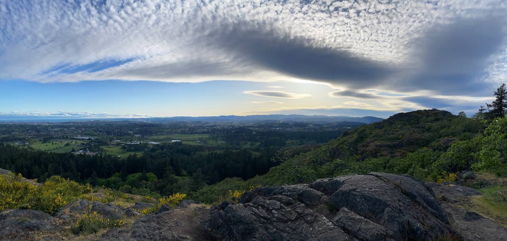
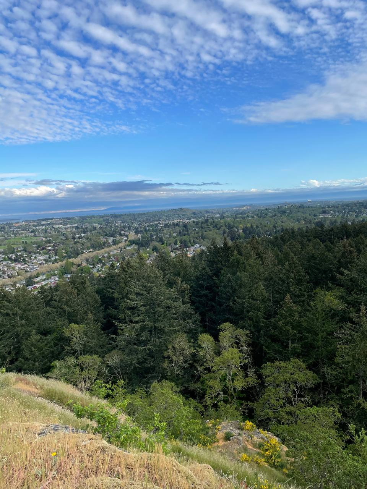

hiked [mount douglas](https://en.wikipedia.org/wiki/Mount_Douglas,_Saanich). was a good reminder to get back in shape; had fun.

also added an [about me](/about-me) page after much deliberation. i wanted this site to just be my own chaotic brain-dump without having to submit to the influence of capitalism which encourages me to sell a version of myself that'll appeal to potential employers, but alas. it *does* make sense to explain a little bit about myself, and if this site wasn't intended to be read by others then it wouldn't be publicly available. 

i may also end up adding a **projects** page that'll go into depth about what i've worked on in the past, what i'm currently working on, etc. the alternative is maintaining a separate website (probably at `alexadewole.com`) that'll contain all the cringe stuff that'll appeal to some hiring managers lmao. i don't like that idea as much; i think i should be able to find some middle ground in making this site my personal haven as well as something that hiring managers can use to guage my sanity (or lack of 🥴). 

worked on another sketch too, the [golden spiral](/s/golden-spiral). it's not *exactly* the golden spiral but it's close enough. not sure what my next sketch will be, but i've been having fun just writing random stuff & fooling around with variables and seeing how they affect what's rendered. i expect sketches will pick up a lot once i start my math class in a week.

# 👋🏾