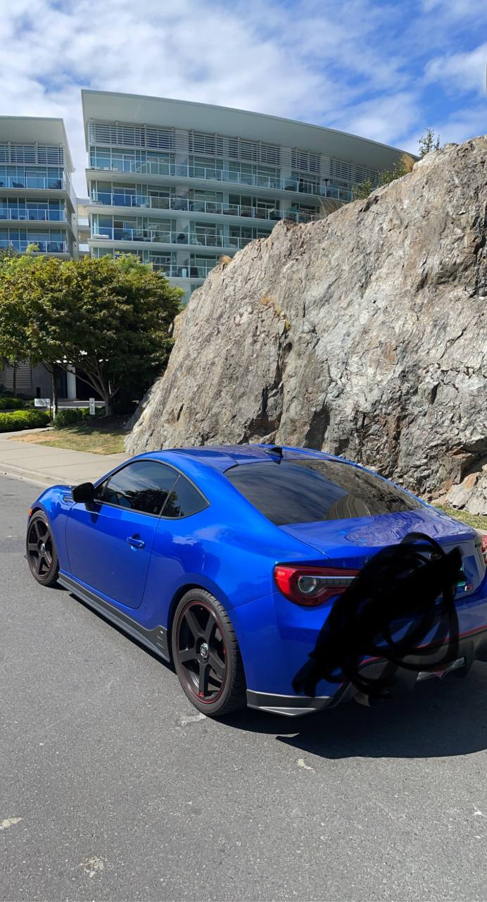

exhaust headers and tint are installed/done! 

even w/ the tiny stuff done to brz, really fucking with seeing the car grow? progress? change? idk. just feel like its gonna be a sick experience as time goes on and i do more mods and stuff. still need to get a tune (cuz am running rich rn) before i get a CEL, coulda dyno'd w/ ecutek but felt like a waste of money because not going to see crazy gains anyways and havent done any mods that warrant a dyno tune yet. will probs opt for an ots tune w/ open flash tablet soon. 

not sure what i should do next to brz. def wanna get some new wheels. im thinking ill try and source the oem tS wing that the OG owner of the car stole 😤. i briefly looked before i bought the car and the shit was fuckin expensive (like 3k+) so there will def be some other contenders too for wings. 

outside of that, i have to decide if i want to go widebody, cuz that'll affect whether i wanna get new wheels right now or later. also want to wrap her so if going widebody it would make more sense to do that after the kit is installed. a ton of stuff to consider, but no rush so it's all good and will be fun 😁. going to chill out w/ car stuff for a tiny bit and just enjoy it as it is right now (she sounds so good!!!).

if my license gets suspended then i will 100% rush widebody. just cuz if im not gonna be able to drive anyways i might as well use that time to do stuff that would normally prevent me from driving. 

#[car startup noises](../../assets/videos/072421.mp4)

